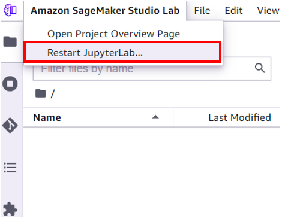
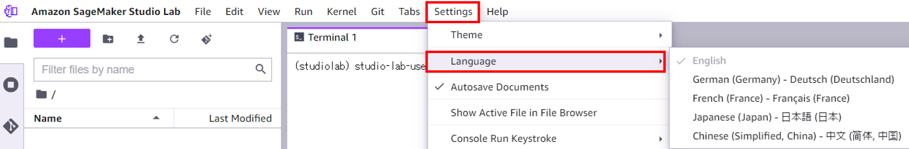

# Localization of the User Interface

We can localize the user interface by using [jupyterlab-language-pack](https://anaconda.org/search?q=jupyterlab-language-pack). Here is the steps for localization.

1. Open the Terminal and install the language pack. The followings are example.
   * German: `conda install -c conda-forge jupyterlab-language-pack-de-de`
   * French: `conda install -c jupyterlab-language-pack-fr-fr`
   * Japanese: `conda install -c conda-forge jupyterlab-language-pack-ja-jp`
   * Chinese: `conda install -c jupyterlab-language-pack-zh-cn`
2. Restart the Jupyter Lab
   * 
3. Setting the Language
   * 
